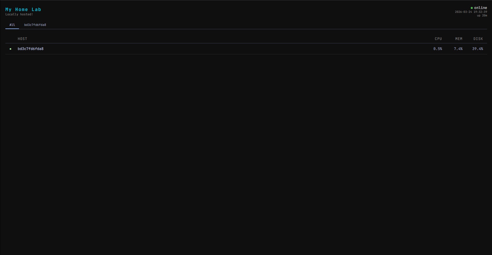
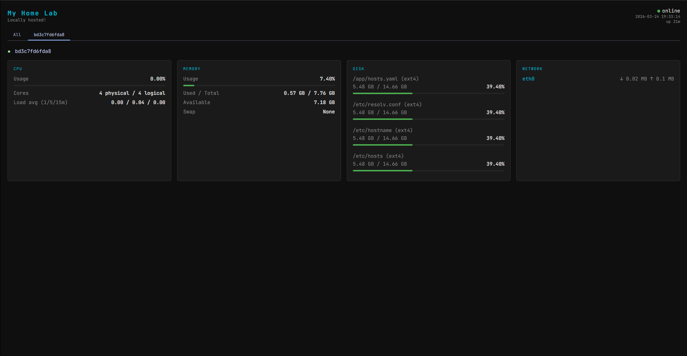

# homelab-dashboard

A lightweight, self-hosted dashboard for monitoring multiple machines in your homelab. A central dashboard aggregates real-time metrics from remote agents running on each host — CPU, memory, disk, and network — served via a FastAPI backend and a live-updating frontend.




## Features

- **Multi-host monitoring** — watch all your machines from a single view
- **Remote agents** — lightweight FastAPI service deployable on any Linux host via Docker
- **Live tab UI** — overview table + per-host detail view, no page reloads
- **Somewhat configurable** — set dashboard name and subtitle via env vars
- **Host registry** — register and remove hosts at runtime via REST API, persisted to `hosts.yaml`

## Tech Stack

- **Python 3.12** / **FastAPI** / **uvicorn**
- **psutil** for host metrics
- **httpx** for async remote agent fetching
- **Jinja2** for HTML templating
- **PyYAML** for host registry persistence
- **Docker** for containerised deployment
- **pytest** + **flake8** for testing and linting

## Architecture

```
┌─────────────────────────────┐
│      Central Dashboard      │  :8000
│  app/  +  templates/static/ │
│  hosts.yaml  (registry)     │
└────────────┬────────────────┘
             │ httpx (async, TTL cached)
    ┌────────┴────────┐
    │                 │
┌───▼───┐         ┌───▼───┐
│ agent │  :8001  │ agent │  :8001
│  pi4  │         │  nas  │
└───────┘         └───────┘
```

Each agent runs `agent/main.py` — a minimal FastAPI app that exposes the same `/api/*` metrics endpoints using the shared `core/metrics.py` module.

## Quick Start

### Central dashboard (local)

```bash
python -m venv venv
source venv/bin/activate        # Windows: venv\Scripts\activate
pip install -r requirements.txt -r requirements-dev.txt
uvicorn app.main:app --reload
```

Open http://localhost:8000

### Central dashboard (Docker)

```bash
docker compose up -d
```

### Remote agent (Docker)

On each remote host, clone the repo and run the agent:

```bash
git clone https://github.com/harrisonarth/homelab-dashboard.git
cd homelab-dashboard
AGENT_TOKEN=your-secret docker compose -f docker-compose.agent.yml up -d
```

Don't forget to change `your-secret`, then register the host on the central dashboard:

```bash
curl -X POST http://<dashboard-ip>:8000/api/hosts \
  -H "Content-Type: application/json" \
  -d '{"id":"pi4","name":"Raspberry Pi 4","address":"192.168.1.10","port":8001,"token":"your-secret"}'
```

## API Reference

### Dashboard

| Endpoint | Method | Description |
|---|---|---|
| `/` | GET | Dashboard HTML |
| `/health` | GET | Health check |
| `/api/metrics` | GET | All metrics for local host |
| `/api/cpu` | GET | CPU only |
| `/api/memory` | GET | Memory only |
| `/api/disk` | GET | Disk only |
| `/api/network` | GET | Network only |

### Host registry

| Endpoint | Method | Description |
|---|---|---|
| `/api/hosts` | GET | List all registered hosts |
| `/api/hosts` | POST | Register a new host |
| `/api/hosts/{id}` | DELETE | Remove a host |
| `/api/hosts/{id}/metrics` | GET | Fetch live metrics from a specific host |
| `/api/all-metrics` | GET | Fetch metrics from all enabled hosts in parallel |

### Agent (runs on each remote host)

| Endpoint | Method | Description |
|---|---|---|
| `/health` | GET | Health check |
| `/api/metrics` | GET | All metrics |
| `/api/cpu` | GET | CPU only |
| `/api/memory` | GET | Memory only |
| `/api/disk` | GET | Disk only |
| `/api/network` | GET | Network only |
| `/api/docker` | GET | Docker stats (stub — returns `available: true/false`) |

## Running Tests

```bash
python -m pytest tests/ -v
```

Linting:

```bash
python -m flake8 app/ agent/ core/ tests/ --max-line-length=100
```

## CI/CD

On every push, both pipelines install dependencies, run flake8, and run pytest.

| Platform | Workflow file | Runner |
|---|---|---|
| Forgejo | `.forgejo/workflows/ci.yml` | self-hosted `docker` |
| GitHub | `.github/workflows/ci.yml` | `ubuntu-latest` |

## Planned

- Ansible playbook for automated agent deployment
- Docker container stats (full implementation)
- Log tailing — stream service logs from the dashboard