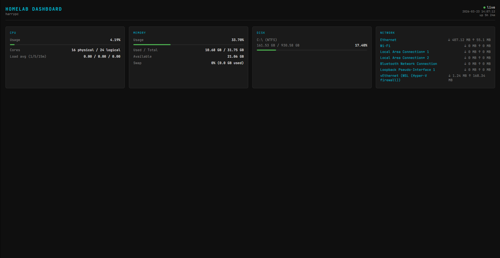

# homelab-dashboard

A lightweight, self-hosted system metrics dashboard for your homelab. Built with FastAPI and psutil, it exposes real-time CPU, memory, disk, and network stats via a JSON API and a Jinja2-rendered HTML frontend.



## Features

- Real-time system metrics: CPU, memory, disk partitions, network I/O
- REST API (`/api/metrics`, `/api/cpu`, `/api/memory`, `/api/disk`)
- HTML dashboard frontend served via Jinja2 templates
- Health check endpoint (`/health`) for monitoring and CI
- Docker support for easy deployment
- CI pipeline (Forgejo Actions + GitHub Actions) with linting and tests on every push

## Tech Stack

- **Python 3.12** / **FastAPI** / **uvicorn**
- **psutil** for host metrics
- **Jinja2** for HTML templating
- **Docker** for containerised deployment
- **pytest** + **flake8** for testing and linting

## Quick Start

### Local (without Docker)

```bash
python -m venv venv
source venv/bin/activate      # Windows: venv\Scripts\activate
pip install -r requirements.txt
uvicorn app.main:app --reload
```

Open http://localhost:8000

### Docker

```bash
docker build -t homelab-dashboard .
docker run -p 8000:8000 homelab-dashboard
```

## API Endpoints

| Endpoint | Description |
|---|---|
| `GET /` | Dashboard HTML page |
| `GET /api/metrics` | All metrics (CPU, memory, disk, network) |
| `GET /api/cpu` | CPU metrics only |
| `GET /api/memory` | Memory metrics only |
| `GET /api/disk` | Disk metrics only |
| `GET /health` | Health check (`{"status": "ok"}`) |

## Running Tests

```bash
pytest tests/ -v
```

Linting:

```bash
flake8 app/ tests/ --max-line-length=100
```
## CI/CD

CI runs on both Forgejo Actions and GitHub Actions. On every push, both pipelines:

1. Install dependencies
2. Run flake8
3. Run pytest

| Platform | Workflow file |
|---|---|
| Forgejo | `.forgejo/workflows/ci.yml` — runs on a self-hosted `docker` runner |
| GitHub | `.github/workflows/ci.yml` — runs on `ubuntu-latest` |

## Planned

- Remote host support — monitor multiple machines from a single view
- Ansible playbook for automated deployment to remote hosts
- Log tailing — stream service/container logs from the dashboard

## License

See [LICENSE](LICENSE).
